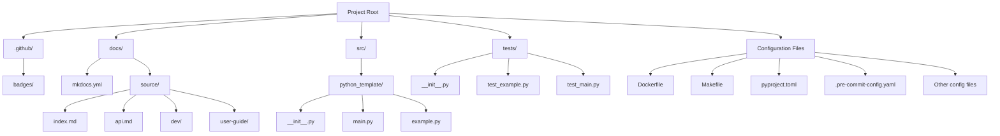

# Usage Guide

This guide explains how to use the Python project template effectively. All tasks are centralized in the Makefile for simplicity and consistency.

## Essential Makefile Commands

Run `make help` to see all available commands. Here are the key operations by category:

### Development Workflow

The template provides a streamlined development workflow with these commands:

<div class="grid" markdown>

=== ":material-format-align-left: Formatting"

    ```bash
    # Format code automatically
    make format

    # Check code formatting without modifying
    make format-check
    ```

=== ":material-code-tags-check: Linting"

    ```bash
    # Run linting checks (ruff, mypy)
    make lint

    # Fix linting issues
    make lint-fix
    ```

=== ":material-flask: Testing"

    ```bash
    # Run tests
    make test

    # Generate coverage report
    make coverage
    ```

=== ":material-shield-lock: Security"

    ```bash
    # Run security checks (bandit)
    make security
    ```

=== ":octicons-git-branch-16: Git Hooks"

    ```bash
    # Install pre-commit hooks
    make pre-commit

    # Run pre-commit checks on all files
    make pre-commit-run
    ```

</div>

### Documentation

Keep your documentation up-to-date with these commands:

```bash
# Build documentation
make docs

# Serve documentation locally at http://localhost:8001
make docs-serve
```

### Docker Operations

Containerize your application with Docker:

<div class="grid" markdown>

=== ":simple-docker: Docker"

    ```bash
    # Build a Docker image
    make docker-build

    # Run the application in a Docker container
    make docker-run
    ```

=== "<span class='twemoji'><svg xmlns='http://www.w3.org/2000/svg' viewBox='0 0 24 24'><path d='M12.628 21.412h3.292v-3.291h-3.292v3.291zm-6.471 0h3.292v-3.291H6.157v3.291zm3.236-6.582h3.292v-3.291H9.393v3.291zm6.363 0h3.292v-3.291h-3.292v3.291zm-3.128 0h3.292v-3.291h-3.292v3.291zm-9.599 0h3.292v-3.291H3.029v3.291zm6.471-6.581h3.292V5.122H9.5V8.25zm6.363 0h3.292V5.122h-3.292V8.25zm-3.236-6.581h3.292V1.15h-3.292v3.52zM19.762.576H1.045l1.389 1.446v16.321h17.327V.576z'/></svg></span> Docker Compose"

    ```bash
    # Start all services with Docker Compose
    make docker-compose-up

    # Stop Docker Compose services
    make docker-compose-down

    # View logs from running containers
    make docker-compose-logs
    ```

</div>

### Environment Management

Manage your development environment:

```bash
# Set up development environment (detects uv/venv automatically)
make setup

# Install dependencies
make install

# Clean up temporary files and directories
make clean
```

## Project Structure

The template follows a clean and organized structure:

<div class="mermaid" style="width: 100%; max-width: 800px; margin: 0 auto;">

</div>

For a detailed listing of all files, see below:

??? abstract "Detailed Project Structure"
    ```
    ├── .github/           # Badge storage
    │   └── badges/        # Project badges
    ├── docs/              # Documentation
    │   ├── mkdocs.yml     # MkDocs configuration
    │   └── source/        # Documentation source files
    │       ├── index.md   # Home page
    │       ├── api.md     # API documentation
    │       ├── dev/       # Development documentation
    │       └── user-guide/ # User guide documentation
    ├── src/               # Source code
    │   └── python_template/ # Main package
    │       ├── __init__.py
    │       ├── main.py
    │       └── example.py
    ├── tests/             # Tests
    │   ├── __init__.py
    │   ├── test_example.py
    │   └── test_main.py
    ├── Dockerfile         # Containerization
    ├── Makefile           # Task automation
    ├── pyproject.toml     # Project configuration
    ├── .pre-commit-config.yaml # Pre-commit hooks
    ├── .gitignore         # Git ignore patterns
    ├── .env.example       # Environment variables example
    ├── .python-version    # Python version specification
    ├── docker-compose.yml # Docker compose configuration
    ├── tox.ini            # Tox configuration for multi-environment testing
    ├── requirements.in    # Input file for pip-tools requirements generation
    └── README.md          # Project overview
    ```

## Customizing the Template

### Rename the Project

1. Update the project name in `pyproject.toml`:
   ```toml
   [tool.poetry]
   name = "your_project_name"
   ```

2. Rename the source directory:
   ```bash
   mv src/python_template src/your_project_name
   ```

3. Update import paths in your code.

4. Update references in Dockerfile and docker-compose.yml.

### Add Dependencies

!!! example "Adding Dependencies"

    === "Poetry"

        ```bash
        poetry add package-name
        # For dev dependencies
        poetry add --group dev package-name
        ```

    === "pip/requirements.in"

        Add the package to `requirements.in` and then run:

        ```bash
        pip install -r requirements.in
        ```

### Configure Tools

Adjust configurations in `pyproject.toml`:

```toml
[tool.ruff]
# Configure Ruff options

[tool.mypy]
# Configure mypy options
```

Update pre-commit hooks in `.pre-commit-config.yaml`.

## Best Practices

!!! tip "Development Workflow"

    1. Make your changes
    2. Run `make format` to format code
    3. Run `make lint` to check for issues
    4. Run `make test` to ensure tests pass
    5. Run `make docs` to update documentation
    6. Commit your changes

!!! warning "Common Pitfalls"

    - Always run tests before committing
    - Keep documentation up-to-date
    - Ensure your code is properly type-hinted
